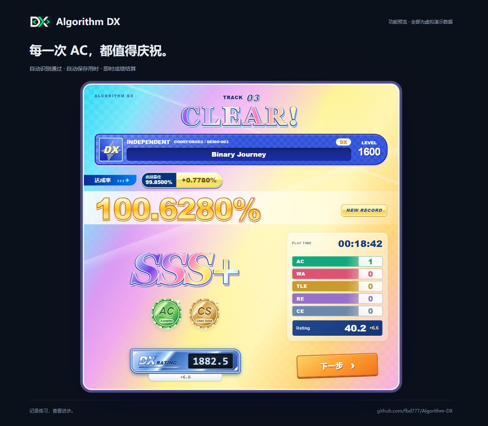
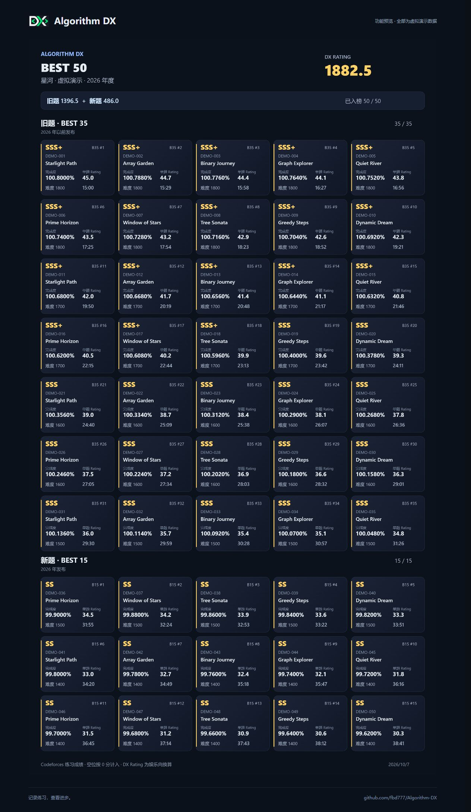
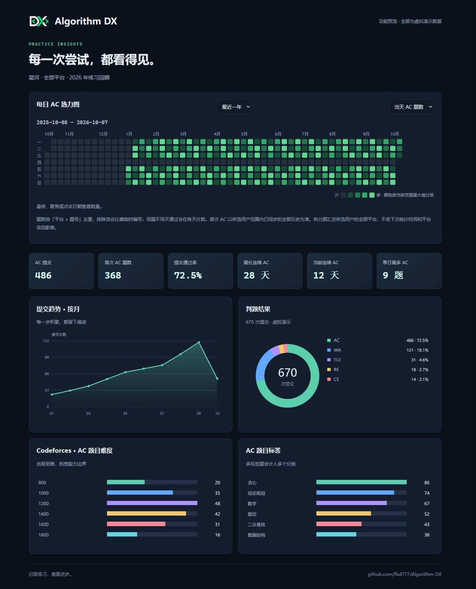
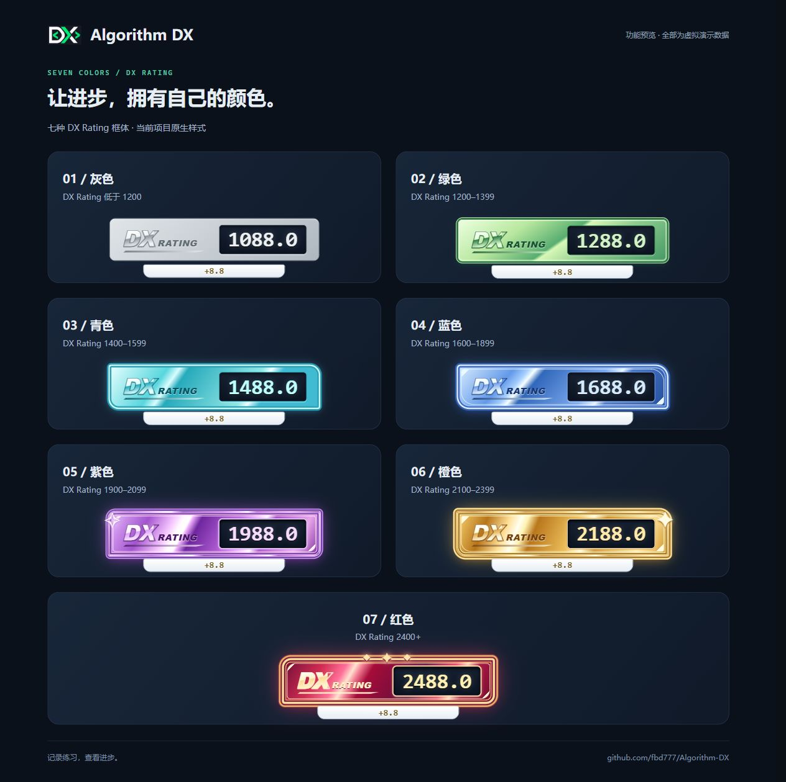
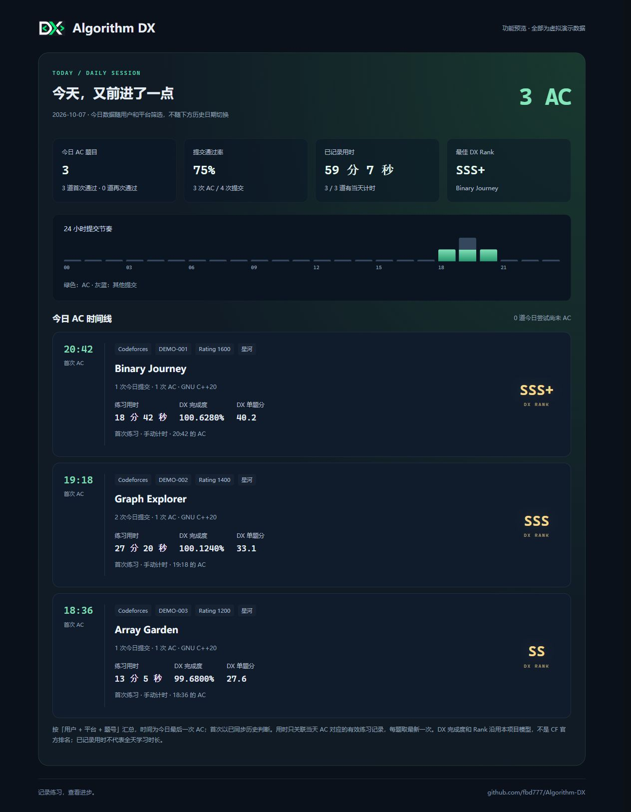
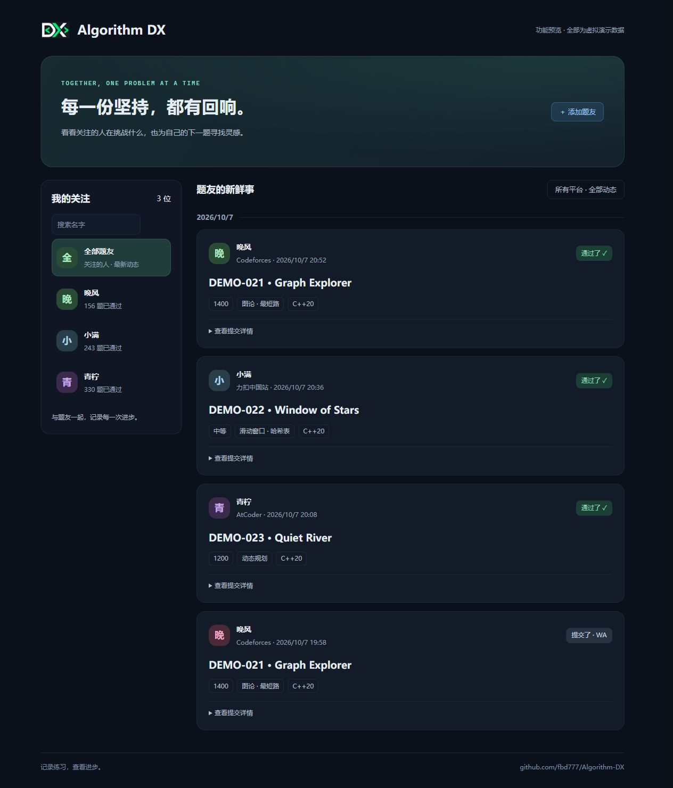

# Algorithm DX

受 maimai DX 启发的本地算法练习 Dashboard：汇总多平台做题记录，用 Codeforces 练习用时生成 B50 与 DX Rating，让每一次进步都看得见。

[下载源码](https://github.com/fbd777/Algorithm-DX/archive/refs/heads/main.zip) · [安装指南](docs/local-install.md) · [平台说明](docs/platforms.md) · [反馈问题](https://github.com/fbd777/Algorithm-DX/issues)

- **B50 与成绩结算**：计时练习、自动识别 AC、保存用时，查看达成率、评级与 DX Rating 变化。
- **多平台记录**：集中查看 AC 记录、题目与逐次练习历史。
- **练习数据**：年度热力图、今日时间线、提交趋势和题目分布。
- **题友圈**：关注题友，查看他们在不同平台的做题动态。
- **本地优先**：数据保存在自己的电脑；零第三方运行依赖，无需构建。

## 功能预览

以下均为**虚拟演示数据**，不代表真实用户记录。点击图片可查看原图。

| 计时与成绩结算 | B50 成绩单 | 做题数据总览 |
| --- | --- | --- |
| <a href="docs/images/timer-result.jpg"></a> | <a href="docs/images/b50.jpg"></a> | <a href="docs/images/practice-overview.jpg"></a> |

| 七种 DX Rating 框体 | 今日练习 | 题友圈 |
| --- | --- | --- |
| <a href="docs/images/rating-frames.jpg"></a> | <a href="docs/images/today-practice.jpg"></a> | <a href="docs/images/friends-circle.jpg"></a> |


## 快速开始

需要 **Node.js 24.15 或更新版本**，无需安装数据库服务，也无需运行 `npm install`。

### Windows

1. 下载完整项目并解压到固定目录，不要直接在 ZIP 中运行。
2. 双击根目录的 `create-desktop-shortcut.cmd`，创建桌面快捷方式。
3. 双击桌面的 **Algorithm DX**。首次启动会自动创建数据库和「我」用户。
4. 在页面「账号管理」绑定平台账号，按需配置登录态并同步。

也可直接双击 `dashboard.cmd`。运行时保持启动窗口开启；关闭窗口会停止服务。

### macOS / Linux / 终端

在解压后的项目根目录运行：

```sh
npm start
```

按终端显示的本机地址打开页面。有桌面环境时，可使用 `npm start -- --open` 自动打开浏览器。

更新、备份、迁移配置与常见问题见[本地安装指南](docs/local-install.md)。

## 支持的平台

**做题记录支持多平台，DX 计分与 B50 当前仅支持 Codeforces。**

| 平台 | 接入方式与主要范围 |
| --- | --- |
| Codeforces | 公开提交同步与历史回补；Group 比赛需额外配置 |
| LeetCode 国际站 | 近期公开提交，不提供完整历史回补 |
| 力扣中国站 | 近期公开 AC；本人历史回补需 Cookie，登录态路径仍有验证限制 |
| AtCoder | 通过 AtCoder Problems 镜像同步，可能存在延迟或缺失 |
| 洛谷 | 登录态记录同步与回补，需自己的 Cookie |
| 码蹄集 | 登录态同步与回补，需自己的 Cookie；保留 JSON 备用导入 |
| 牛客 | 公开编程练习记录同步与回补，不包含选择题 |

统计以本地已同步记录为准，不保证等于平台完整历史。各平台的配置、验证范围与限制见[平台说明](docs/platforms.md)。

## B50 怎么计算

- 根据 Codeforces 题目难度与有效练习用时，计算单题达成率、评级和 Rating。
- 取旧题中表现最佳的 **35 道**，加上所选年度新题中表现最佳的 **15 道**。
- 新旧题按**出题年份**划分，不按 AC 日期划分；未计时或缺少题目评级的记录暂不计分。

DX Rating 是本项目的娱乐向练习指标，不是 Codeforces 官方 Rating。评分模型及外推范围见[计分说明](docs/dx-rating.md)。

## 数据与隐私

数据默认保存在 `data/algorithm-dx.sqlite`，配置与平台凭据保存在本机。项目没有云账号、云同步或遥测，HTTP 服务仅监听 `127.0.0.1`。

**打开页面时可能触发自动同步**；自动或手动同步会访问对应平台。凭据只用于对应平台的数据读取，请勿提交 `.env` 或个人数据库到仓库。

## 文档与开发

- [本地安装、桌面快捷方式与更新](docs/local-install.md)
- [平台接入与数据边界](docs/platforms.md)
- [DX Rating 与 B50 计分说明](docs/dx-rating.md)
- [练习历史与离线回测](docs/backtesting.md)
- [目录、数据模型与 API](docs/development.md)
- [Codeforces × maimai 统计实验](docs/cf-maimai-study.md)

技术栈：Node.js / TypeScript / SQLite / 原生 HTML、CSS、JavaScript。运行测试：`npm test`。欢迎反馈问题和提交 Pull Request。

项目采用 [MIT 许可证](LICENSE)，允许使用、修改与分发；是否合并贡献由维护者决定。

## 支持项目

如果 Algorithm DX 对你有帮助，点个 Star、反馈问题或分享给朋友，都是对本项目的支持。

<details>
<summary>自愿赞赏 · 支持后续维护与更新</summary>

感谢你的使用与支持。

<a href="public/support-code.png"></a>

</details>
