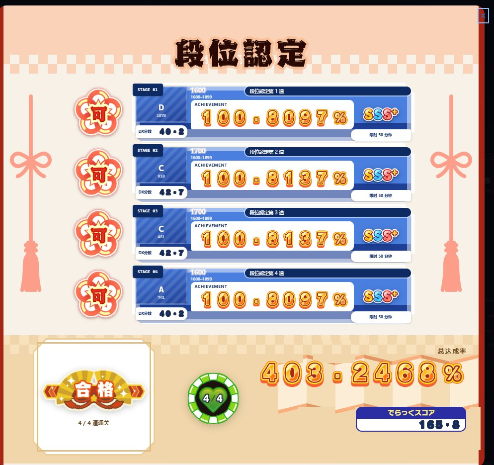

# 随机抽题与段位認定

「随机抽题」把选题的权力从用户手里拿走：服务端抽一道，一开始只告诉你**难度**，点「开始做题」才揭题并起计时。照舞萌 DX 的随机段位認定做的挑战模式则是「做完一道立刻再抽一道，一共四道」，另外还有不分段的**小随机**与**大随机**段位。

先说完边界：**这是自测，不是防作弊。** 它唯一能保证的是你没法挑题。详见[「自测，不是防作弊」](#自测不是防作弊)。

## 档位

四个档位按 Codeforces 官方难度（rating）划分，覆盖 800–2600：

| 档位 | 区间 | 单题限时 |
| --- | --- | --- |
| 初级 | 800–1100 | 30 分钟 |
| 中级 | 1200–1500 | 40 分钟 |
| 上级 | 1600–2000 | 50 分钟 |
| 超上级 | 2100–2600 | 60 分钟 |

区间互不重叠，并集正好覆盖 800–2600（相邻区间之间没有空隙，`tests/dan.test.ts` 里有断言）。限时随难度递增。

「每日一题」不分档位，从四个区间的**并集**（800–2600）里抽，限时 45 分钟。

上限为什么卡在 2600：DX Rating 的 T97 曲线在 2000 以上属于外推区（`productionReady: false`，见 [dx-rating.md](dx-rating.md)）。再往上题目数量也少得没法按 rating 均匀抽。

## 抽题口径

### 按 rating 均匀，不按题目均匀

题库里各 rating 的题目数量分布极不均匀：800–899 有 1104 道，900–999 只有 354 道，再往上大致每 100 分 450–540 道。如果直接对题目集合随机挑一道，「初级」会几乎全是 800 分。

所以抽题分两步：**先在区间内的 rating 值之间均匀选一个，再在该 rating 的题目里随机选一道**（`drawDanCandidate`）。这样每一档的难度分布是均匀的，与每个 rating 桶里有多少题无关。

CF 题目的官方 rating 都是 100 的倍数（实测全量 11152 道有评级的题去重后只有 28 个取值），所以每一档实际只落在 4–6 个难度级别上：

| 档位 | 题目数 | rating 取值 | 最大桶 | 最小桶 |
| --- | --- | --- | --- | --- |
| 初级 800–1100 | 2312 | 4 个 | 800 分：1104 道 | 900 分：354 道 |
| 中级 1200–1500 | 1875 | 4 个 | 475 道 | 462 道 |
| 上级 1600–2000 | 2578 | 5 个 | 537 道 | 494 道 |
| 超上级 2100–2600 | 2576 | 6 个 | 477 道 | 347 道 |

也就是说「初级」是四个难度级别各占 1/4，而不是让 1104 道 800 分挤掉 354 道 900 分。每日一题在 800–2600 上是 19 个取值，每档抽到区间上界的概率就是 1/4 到 1/19。

### 排除做过的题

抽题前会剔除三类题：

1. **本机提交记录里出现过的** —— 包括**只有 WA、没有 AC** 的（拿到 WA 也算见过，只排 AC 会让「做过但没做出来」的题反复出现）。
2. **归档账号上的提交** —— 这里**故意不看 `accounts.is_archived`**，和其他地方「只算当前账号」的口径不一样（B50、题友圈、练习记录都带 `is_archived=0`）。归档的含义是「这个账号不再同步了」（换 handle、换号时旧账号会被归档），**不是**「那些题我没做过」；带上这个条件的话，换过一次 handle 的人之前 AC 过的题会全部重新变成可抽。
3. **正在计时 / 计时过的题** —— 计时可以不经提交直接对题号开始（「专注计时」的正常用法），不看这一处的话段位有可能抽到你手上正在做的那道。

依据是本机数据库，所以**同步不完整时仍可能有漏网的**（比如刚 AC 还没同步）。这一点在页面上也写明了。

### 每日一题可复现

每日一题用 `(日期, 用户)` 做种子确定性抽取：同一天怎么刷新都是同一道，换一天才换题。随机抽题与挑战模式用 `crypto.randomInt`，服务端抽、服务端存。

### 每日一题按水平定带

每日一题的难度带**以用户当前的等效 Rating 为中心 ±200**，而不是从 800–2600 全段乱抽：

- **等效 Rating = B50 榜的平均单题 rating × 50**。这是评分模型自己的锚（`rating.ts`：「单题 rating × 50 = 等效 CF Rating」）。榜填满 50 格时它与 DX Rating **完全相等**；没填满时它仍是诚实的水平估计 —— 直接拿 DX Rating（求和口径）当中心的话，四道 1700 分的题总分只有 ~136，带子会整天贴着 800。
- 中心**取整到 100** 再定带：一次同步把分数从 1543 推到 1549，今天的题不会跟着换；跨过 1550（取整到 1600）带子才挪一次。这是「按水平定带」的代价，如实写在这里。
- 两端裁进档位并集 [800, 2600]。于是水平很低时带子收敛到 [800, 800]（从最简单的抽），很高时收敛到 [2600, 2600] —— 2600 以上是 T97 外推段（`productionReady: false`），档位刻意不往上走，每日一题跟同一口径。
- 榜上没有任何可计分的成绩（没 AC 过、或 AC 了但从没填过用时）时退回全段，卡片上说明原因。
- 抽取本身仍是 `(日期, 用户)` 确定性：同一天刷新不变（见上一节）。

页面上把带子说出去：「等效 Rating 2199 → 2000–2400」，用户才知道今天的难度为什么是这个。

### 自定义单题抽题

「随机抽题」卡片里除了四个档位，还有**自定义条件**：难度范围（800–3500）+ 标签（多选，**含任一**）。

- 平台锁定 Codeforces：抽题的前提是有**全量题库**，现在只有 CF 有（`problemset.problems`，11152 道）；洛谷/码题集只有提交抓取，没有本地题库，而且洛谷的难度是另一套制。标签数据来自同一份抓取 —— CF 的 `problemset.problems` 本来就带每道题的 tags，**不新增数据源**（缓存键从 v1 升到 v2 就是为了把 tags 带上）。
- 上界放到 3500（题库的真实上界）：这是用户自己的明确选择。2600 以上仍是外推段，表单上写明了。
- 标签取**并集**（「含任一」）而不是交集：「dp AND graphs AND greedy」这种交集在 11000 道的题库里也常常是空的。最多选 8 个；题库里没有的标签在 start 时直接拒（400），不会静默抽错。
- **口径 A 原样适用**：条件在 start 时发给服务端，题目照样只在服务端抽；点「开始做题」之前，页面里没有这道题的题号与链接。排除做过的题用同一套 `danExcludedProblems`。
- 条件**落库**（`dan_sessions` 的区间列本来就有，标签进 020 新加的 `tags_json`），并冻结进结算快照 —— 历史记录能按当时的条件解释，「再来一轮 · 自定义」也会带上当时的条件。
- 限时随当题难度走（与随机段位同一套 `danLimitForRating`），不是统一值。
- 自定义只用于**单题**模式：挑战（段位認定）的档位是固定口径，不跟自定义条件混。

## 口径 A：开始做题之前，链接不下发

**未开始的题目，题号与链接根本不会离开服务端。** 这不是「发到前端再藏起来」，而是服务端在组装响应时就不给：

- `GET /api/dan` 与抽题响应里，未 claim 的 stage 只含 `difficulty`，`problemId` / `problemUrl` 都是 `null`（`src/dx/dan.ts` 的 `danStageView`：只有 `claimed_at !== null` 才填）。
- 唯一的出口是 `POST /api/dan/claim`，它同时做三件事：起计时器（`practice_timers`）、写 `claimed_at`、把 `problemId` 与 `url` 返回给你。前端拿到之后立刻 `location.href` 跳走。

因此**右键、F12、查看网络请求、刷新页面都拿不到** —— 那道题的链接在那个时刻还不存在于任何下发数据里。

这条口径也意味着刻意**不做**这些东西：

- 不屏蔽右键与 F12（屏蔽不掉，而且会干扰正常使用；拦不住的东西不该写成注释里的「保护」）。
- 不做前端混淆或把链接藏在 base64 里（同样是「发下去了」，只是难看）。

`tests/dan.test.ts` 里有一条断言直接搜序列化后的响应体：claim 之前不得出现 `codeforces.com`，也不得出现任何 `contest:index` 形态的题号。API 层另有一条断言覆盖 `GET /api/dan`。

## 挑战模式（段位認定）

一轮挑战是 4 道题、逐题限时：

```
active ──四道全部通关──→ cleared（通过）
   │
   ├──任一道超过限时──→ failed（未通过），本轮立即结束
   └──用户主动放弃──→ abandoned
```

- 第 N 道通关（后台同步发现 AC）后，服务端结算该题，下一道的抽取由 `POST /api/dan/next` 触发。
- 任一道超过限时即判为**本轮失败并结束**，不会继续抽第 N+1 道。
- 一个用户同时只能有一轮进行中的认定（应用层检查 + 数据库上的 partial unique index `one_active_dan_per_user`）。
- 抽了不点也会到期作废（默认 24 小时），不会把唯一的活动轮次永久占住。

### 不发段位名

挑战模式**不给段位名**，结算只展示各题结果与总分（各道单题 rating 之和）以及通过／未通过。

这是照舞萌 DX 的规则定的：随机段位認定本来就不给段位名，给段位名的是**固定选曲段**。所以这里也没有分数段／等级线（AAA、S 之类）—— 只有每题自己的达成率与评级。

### 小随机与大随机

两个**随机段位**，rating 都**不分段**（取四个难度档的并集 800–2600 整段），都是 4 道、都逐题限时。区别只有抽题分布：

| | 抽题分布 | 每个 rating 值的概率 |
|---|---|---|
| 小随机段位 | 按 rating 均匀：先均匀选 rating 值，再在该值内选一道 | 全部相同（1/19 ≈ 5.3%） |
| 大随机段位 | 按题目均匀：不保证难度分布 | 由该难度的题目数决定 |

用真实题库（800–2600 共 9341 道）实测的差别：

| 指标 | 小随机 | 大随机 |
|---|---|---|
| 单道抽到 800 分的概率 | 5.3% | **11.8%** |
| 最冷门难度（2600，347 道）的概率 | 5.3% | 3.7% |
| 期望难度 | 1700 | 1637 |
| 四道全都 ≤1100 | 0.21% | 0.36% |

**别对「大随机」期待过头**：它在我们的题库里只是把 800 分的概率抬到 2.2 倍、期望难度压低约 63 分，并不会真的「四道全是 800」—— 因为 CF 的 800 分题只占池子的 11.8%，而不是像舞萌的简单曲那样占绝大多数。大随机在南梦宫那边看起来那么极端，是因为那边简单曲的占比本来就更悬殊。

（反直觉的一条：大随机**反而更难**抽到超上级。小随机里 2100+ 有 6 个值、合计 6/19 = 31.6%；大随机里那几桶在池子里只占 27.6% —— 800 分那一桶把份额吸走了。四道里至少一道超上级：小随机 78%、大随机 72%。）

### 逐题限时随题走

随机段位的题横跨 800–2600，一个统一限时对两头都不公平（给 800 分 60 分钟、给 2600 分也 60 分钟）。所以随机段位的限时**按当题难度**落到对应档位：≤1100 → 30 分、1200–1500 → 40 分、1600–2000 → 50 分、2100+ → 60 分。

- 限时在**抽到的那一刻**写进 `dan_stages.limit_seconds`（`migrations/019`），与 `difficulty` 一样是快照 —— 之后调档位区间不会把这一轮重新解释一遍。
- 该列为 NULL 的是 019 之前抽出来的行，它们属于「档位统一限时」那一套规则，沿用 `dan_sessions.limit_seconds`，旧记录的解释一个字都不变。
- 四道限时之和平均约 185 分钟 —— 这是上限，不是预期耗时。

### 路径失败也算失败

- 某题超时 → 本轮 `failed`，立即结束。
- 超时那道**没有成绩**：计时器在超时那一刻被取消（`practice_timers.status='cancelled'`），不会生成 `practice` 记录，自然也不进 B50。已经通过的那几道不受影响，照常计分。
- 超时时间取的是**限时截止那一刻**（`claimed_at + limit_seconds`），不是「发现超时的那一刻」—— 否则一次晚同步会把用时和分数一起撑大。

### 结算分两层

**第一层是单题结算**，在每道题出成绩时弹出：用的就是普通计时练习那张结算皮（`public/dx-result.css` 的 `.dx-result-sheet`），显示达成率、此前最佳、评级、用时、判定计数、单题 rating，以及结算那一刻的 DX Rating 总分与增量。这段对比读的是 `practice_timers.settlement_json` 里冻结的那一份 —— 段位認定不另算一套分。

**第二层是整轮结算页**，四道打完（或中途失败）后出现，直接上原作的画面素材（`Process/Course/CourseResultProcess` 那一屏）：

<a href="images/dan-settlement.jpg"></a>

- **底图**：整屏就是原作那张 980×928 的成品图 —— `UI_DNM_Result_Base_01`（「段位認定」）与 `UI_DNM_Result_Base_03`（「ランダム段位認定」）。页头文字、格纹页眉、两侧水引（蝴蝶结 + 竖绳 + 流苏）、下半部色带与左下角那格白框**全部烘焙在底图里**，所以档位挑战与随机段位各用自己那一版，标题不再由页面画。
- **底图补过一处**：下半部色带里有三块**挖白的空面板**（`(503,663) 213×52`、`(753,677) 104×38`、`(608,810) 360×80`）—— 那是原作留给运行时贴图的位置（标签、按钮一类），运行时会被盖住，所以底图上就留了白。我们不需要显示那么多信息，白块露出来只会像「空框」，所以 `scripts/patch-maimai-result-band.py` 按底图自己的花纹把这几块续画填掉了：色带是平涂竖向色块 + 斜向橙色折线，水平方向**严格周期**（干净区自比，`p=115` 时平均差只有 2.8，再往上都是倍频），整块矩形都能从 `x±k·115` 的同相位列搬过来，折线接缝对得上。左下角那格段位名牌**保留** —— 那一格我们拿来盖合格印。重新提取底图（`extract-maimai-assets.py`）会把挖白带回来，补跑一次这个脚本即可（已补过的图它认得出，会跳过）。
- **组件按官方坐标拼**：底图之上每一件都放在原作预制体（`Process/Course/CourseResultProcess`、逐题行的 `UI_CMN_KOP_TrackData`）量出来的位置上，尺寸也照官方：逐题行 `x 267–843`、第 1 行 `y 152`、行距 `122`（576 宽 = 官方 640 × 0.9）；行首的印是 `108×108`（官方原始尺寸，不是缩过的）；达成率数字字高 `41`；曲绘槽 `104×72`（官方 `JacketImage_S` 113×113 × 0.9 的位置）。这些数字写在 `public/dan.css` 顶部注释里，`dan-settlement-check` 里有一条断言直接量它们（`行内组件互不重叠、也不伸出边框`），底部白框、白缎带的位置也是拿底图逐行数像素量出来的。
- **逐题卡**：每道一张。左侧一枚原作印（`UI_DNM_Icon_Result_01` 可 / `_02` 不可，未抽到的变灰）；右侧横卡用原作底板 `UI_DNM_Result_musicBase_01` 撑起来，上面再压一层**乐曲边框** —— 版式照官方 `UI_CMN_RSL_KopMBase_*`（640×140）逐像素量出来画：外圈浅色环 + 主色场 + 底部浅色带 + 左侧曲绘槽 + 深蓝标题条（带官方那圈白边）+ 白色达成率框 + 深蓝行首小牌（官方 `JaketTrack`）。**颜色不烘死**：官方那五张（BSC/ADV/EXP/MST/MST_Re）把难度色和难度名都印在图里，套不上我们自己的 CF 分档，所以边框按 `--tc1/--tc2` 上色（`cfRatingColor(...).tone` → `TRACK_TONE`）。
- **信息分配改了官方的排法**：官方右边一列挤了四件（评级 / 难度分 / 限时 / DX分数），四道并排看下来就是一堵字墙。现在左边是「跟题目走的东西」—— 曲绘槽换成**按档位色上色**的题号牌（官方那格是白底，纯白在满屏深色里就是一块洞），下面挂一块白牌写这道题的单题 rating（`DX分数`）；难度名牌那一格写「档位 rating + CF 区间」（官方烘的是 `MASTER` 这类难度名）；右边只留评级徽章与这道题的限时白牌。达成率大数字 + 官方彩色「%」字形 + 官方评级徽章（`UI_CMN_TabTitle_Rank_*`）仍在中间。
- **底部色带**：左下白框那一格原作放段位名牌，我们不显示段位名，改成把合格印**盖在白框里面**（之前印比框还大，两边各糊出去 30px）并在印下面写通关题数；中间是原作的剩余生命底盘（`UI_DNM_Base_Life_01` 绿 / `_03` 红）里面写「通关几道」；右边两块**右对齐到同一条边**（`x 945`）：上面是「总达成率」+ 官方数字图集拼的大数字，下面是官方「でらっくスコア」标签（`UI_RSL_DXScore_Base`）—— **那张标签本身就是个框**：226×54 里 `y 0–25` 是蓝底白字，`y 26–50` 留了一块 `218×25` 的白，那块白就是给分数用的，所以 `DX分数` 的数字写在框里（`padding-right: 8px` 右对齐），不是排在框右边。整张框按原尺寸放在补干净的色带上（`(719,805) 226×54`）。
- 数字不是 CSS 字体画的：**官方数字图集逐格切**。图集是规整 4×4 网格，格子由同名 Sprite 定 rect；白字族每格拆成「官方 `_Outline` 剪影当遮罩上深色（描边）+ 官方填充图集」两层 —— 图集本身是**纯白剪影**（游戏运行时才染色），background 层没法单独染色，所以用两个真元素叠。这套「剪影 + 运行时染色」的能力也直接用在了 DX 分数上（染成帧上的深蓝 `#0d2a63`，见下）。对照表（一张张看出来的）：白字族 `[0-9]` `[10]'+'` `[11]'-'` `[12]','` `[13]'·'`（居中的圆点，就是这套字体的小数点）`[14]'%'`；分数族 `[10]'+'` `[11]'/'` `[12]'%'` `[13]'.'`。
- **达成率按分数换色**：官方那套 `UI_NUM_Score_0001111_{Blue,Gold,Red}` 是同布局的三色分数图集（自带颜色、不叠描边），末尾的大「%」字形 `UI_RSL_Score_Per_{Blue,Gold,Red}` 同样三色 —— 所以达成率的档位就是三档：`≥100%` 金（SSS/SSS+）、`≥97%` 蓝（S～SS+）、再低红。`scoreTone()` 在 `public/dan.js` 里，换色在同一条 `achievementNumber()` 里做。**官方那张 `UI_NUM_Score_0001111_Base` 是一张空图集**（16 格里一个字形都没有，整张只有几列杂散像素），照它渲染出来就是一片看不见的灰影，别用。
- **DX 分数不上分数色**：那一格显示的是单题 rating、不是 DX 分数比率，所以三色专门留给达成率；它用白字族剪影染深蓝（跟标题条、标签同一个深蓝）。**所有「没有成绩」的占位「—」也走这套染色**：白字族是纯白剪影，直接铺在白色达成率框或浅色底图上等于看不见。
- **说明与按钮在画面之外**（深色底上）：「好」按钮与「再来一轮 · 档位」不往那张成品屏里塞；这一轮的范围说明（档位区间、题数、限时、抽题方式、标签）也挪到了成品屏下面 —— 原作那张纸上没有放这行字的位置，硬塞只能压住页头或第一行。

两处刻意的改写：

- 原作那一格写的是**段位名**（例如「十段」）。随机段位認定不发段位名，所以那一格改成盖判定印「合格」／「不合格」。
- 原作那颗心是**剩余生命**。我们没有生命值这个概念，用它显示「通关几道」（合格绿、失败灰）。

两处数字口径与原来的对照：原作的「总达成率」是四首歌达成率之和，这里就是各道达成率之和；原作的 `DX分数` 是四首 DX 分数之和，这里对应各道单题 rating 之和（也就是本轮的 `totalRating`）。

### 结算页的素材来源

`public/assets/maimai/` 下那 28 张 PNG 是从 maimai DX 客户端资源里直接提取的，不是重画的：

| 仓库文件 | 客户端贴图 | 用途 |
| --- | --- | --- |
| `result-dani.png` | `UI_DNM_Result_Base_01` | 「段位認定」整屏底图 980×928 |
| `result-random.png` | `UI_DNM_Result_Base_03` | 「ランダム段位認定」整屏底图 |
| `track-plate.png` | `UI_DNM_Result_musicBase_01` | 逐题行底板 576×124 |
| `stamp-clear.png` / `stamp-fail.png` | `UI_DNM_Icon_Result_01` / `_02` | 逐题「可」／「不可」印 |
| `verdict-clear.png` / `verdict-fail.png` | `UI_DNM_Icon_Clear` / `UI_DNM_Icon_NoClear` | 「合格」／「不合格…」印 |
| `num-26p.png` / `num-90p.png` | `UI_CMN_Num_26p` / `90p` | 小 / 大号白字图集（136×160 · 356×420，4×4 格） |
| `num-26p-outline.png` / `num-90p-outline.png` | `UI_CMN_Num_26p_Outline` / `90p` | 同布局的描边剪影（上深色当描边用） |
| `num-score-blue.png` / `-gold.png` / `-red.png` | `UI_NUM_Score_0001111_Blue` / `_Gold` / `_Red` | 达成率的三色分数图集（自带颜色，296×392） |
| `score-per-blue.png` / `-gold.png` / `-red.png` | `UI_RSL_Score_Per_Blue` / `_Gold` / `_Red` | 达成率末尾那个大「%」字形（80×80，同样三色） |
| `rank-sssp.png` … `rank-bbb.png`（8 张） | `UI_CMN_TabTitle_Rank_SSSp` … `_BBB` | 逐题评级徽章 |
| `life-base-green.png` / `life-base-red.png` | `UI_DNM_Base_Life_01` / `_03` | 剩余生命底盘（绿 = 通关 / 红 = 未通关） |
| `dxscore-label.png` | `UI_RSL_DXScore_Base` | 「でらっくスコア」标签 |

**故意不搬的一件**：逐题行的乐曲边框 `UI_CMN_RSL_KopMBase_{BSC,ADV,EXP,MST,MST_Re}`（640×140，五种难度各一张）。它是逐题行那一圈底色，但难度色与难度名（BASIC/ADVANCED/EXPERT/MASTER/Re:MASTER）都烘死在图里，套不上我们的 CF 分档，所以照它的版式用 CSS 画一层、颜色交给 `--tc1/--tc2`（见 `public/dan.css` 的「逐题行」一节，尺寸全按那张贴图量出来）。

提取脚本留在 `scripts/extract-maimai-assets.py`（开发工具，需要 `UnityPy` + `texture2ddecoder` + `Pillow`，不是应用依赖）：

```bash
python scripts/extract-maimai-assets.py "<含 resources.assets 的游戏目录>"
```

贴图对应的**贴图名**是拿 UnityPy 枚举客户端 `resources.assets` 的 `Texture2D` 得到的（那一个文件里有 5916 张，`UI_DNM_*` 家族 159 张）。数字图集的**格位**不用量：每格都有同名 Sprite（`UI_CMN_Num_90p_0 … _14`），网格正好 4×4，`下标 × 格宽/格高` 就是裁切位置；`[12]` 是逗号、`[13]` 是居中的圆点（原作这套字体的小数点就画在字高中线上，不是落在基线上的点），这两格是放大到 6 倍 + 量墨迹包围盒确认的。分数族那三套的格位同样按 4×4 / 74×98 切；**同名的 `Base` 那张是空图集**，是数每格不透明像素数（16 格全是 0）发现的 —— 只看缩略图会以为它有内容。

版式数字不是估的：它们是拿 `UnityPy` 读 `CourseResultProcess` / `UI_CMN_KOP_TrackData` 预制体里每个 `RectTransform` 的 anchors / anchoredPosition / pivot / sizeDelta，再按「美术坐标 = 屏幕中心 + 局部位置」换算到 980×928 底图上（逐题行 576×126 = 官方 640×140 × 0.9）。乐曲边框那几块（白框、标题条、曲绘槽、行首小牌、DX 分数牌）另外拿官方贴图逐行数像素复核过一遍（白/深蓝的横向连续段），两边对得上。早先那版是按底图像素分区（纸区上边界 `y=140/928=15.1%`、底部色带从 `71.6%` 起、左下白框 `x 8.7–31.6% / y 73.3–94.8%`）粗摆的，现在换成官方坐标后位置差了几十像素 —— 也就是「组件没对齐」的那几十像素。

盘面锁死 `980×928`（固定宽高，不再用 `aspect-ratio` 缩放），窄屏让盘面横向滚动而不是压扁 —— 内部一律绝对像素，缩放交给浏览器等比处理，这样「一个数字多宽」这类关系可以直接抄官方数字。

一处已知的将就：**单题模式（自定义条件／每日一题）也复用这张结算盘**，它们是 1 道题，底图借的是档位那一版，所以页头会写着「段位認定」。这不是这轮引入的 —— 改造前那张 CSS 皮的标题也是写死「段位認定」（`#danRunTitle` 一直没按 `kind` 变过），这一版只是把标题从 CSS 文字换成了烘进底图的字。单题模式要专属皮的话，得另找一张不带页头的纸底图，或者按 `kind` 裁掉底图上那 15.1% 的页头带。

**这些美术素材有版权**：它们不属于这个仓库的 MIT 许可范围，也不随上游项目走。只在自用/自部署的实例里使用；要不要把它们留在分支上，由部署的人自己判断。这一段替换了早先「用 CSS 重画、不搬游戏美术」的做法，是按 2026-10-09 的明确要求改的。

### 下一道由你点，不由轮询抽

出成绩之后页面停在结算上，不会自己往下抽：

- 轮询调的是 `POST /api/dan/settle` —— **只结算、不抽题**；
- 只有点单题结算上的「抽选下一题」才会调 `POST /api/dan/next` 去抽下一道；
- 最后一道的按钮是「查看本轮结算」，点了进整轮结算页。

否则你还在看这一道的成绩，下一道就已经悄悄抽好了，等于把「抽题」这一步藏起来。（`tests/dan.test.ts` 里有一条断言盯这个：调 `settle` 之后 `dan_stages` 不得多出一道。）

如果结算比页面刷新更快（服务端同步任务常常如此），打开页面时会把 90 秒内刚结束的那一轮结算补弹一次，只补一次。

## 成绩的去向

挑战与随机抽题的成绩**不是另一套计分**：走的就是正常的计时练习那条链。

- 起计时 → `practice_timers`；AC 被同步到 → 生成 `practice` 记录（`timing_source` 在库里存 `manual`，读取时因为存在对应计时器而被 `listPractice` 报成 `timer`）。
- 因此这些记录**正常进入 B50 与 DX Rating**，可以在 [DX Rating](dx-rating.md) 页面看到。

## 自测，不是防作弊

开始做题之后，你照样可以看题解、问 AI、查博客 —— 这一点拦不住。它和「辅助解题」自报标签是同一条现实：**本地优先的工具只能记录你的自述，不能证明你的清白。**

这个功能能保证的只有一件事：**你没法挑题。** 抽到什么做什么。

另外，「排除做过的题」依赖本机已同步的提交记录；同步不完整时可能抽到你已经做过的题（包括已经 AC 过的）。

## 数据

迁移 `018-dan.sql`、`019-dan-random.sql` 与 `020-dan-custom.sql`，两张表：

- `dan_sessions`：一轮认定（`tier`、`kind` ∈ `challenge` / `single` / `daily`、`stage_count`、`limit_seconds`、`min_rating` / `max_rating`、`status` ∈ `active` / `cleared` / `failed` / `abandoned`、起止时间、`total_rating`、结算快照 `settlement_json`、`tags_json`（020 新增，自定义抽题的标签条件，NULL = 无条件））。
- `dan_stages`：一道题（`session_id`、`stage_index`、`problem_id`、`difficulty`、`drawn_at`、`claimed_at`、`timer_id`、`outcome` ∈ `cleared` / `timeout` / `interrupted`、`seconds`、`score_json`、`limit_seconds`（019 新增，NULL = 沿用 session 的档位统一限时））。

两个随机段位**没有新增 `kind`**：它们沿用 `kind='challenge'`，靠 `tier`（`small_random` / `big_random`）区分。加一个 `kind` 值要重建整张 `dan_sessions`（SQLite 改不了 `CHECK`），而 `tier` 已经能表达这件事，019 也就只需要一条加列。**自定义抽题同理**：`tier='custom'`，难度范围复用本来就有的 `min_rating` / `max_rating` 两列，020 只为标签加了一列。

两个设计点：

- **难度在抽题时快照进 `dan_stages.difficulty`**，结算时不重新查题库。否则等题库缓存过期或题目 rating 被 CF 修订，历史记录会跟着变。`limit_seconds` 同理。
- **`settlement_json` 在结束时冻结**整轮结果，记录页读的是快照，不是重新算一遍。

## API

| 方法 | 路径 | 说明 |
| --- | --- | --- |
| GET | `/api/dan?user=&tz=` | 抽题面板与记录页。档位表（`tiers`）、两个随机段位（`randomTiers`）、标签清单（`tags`，带题量）、每日一题的难度带（`dailyBand`）、题库是否就绪、每日一题的**难度**、进行中的一轮、历史记录 |
| POST | `/api/dan/start` | 开一轮：`{userId, kind, tier?, tz?}`。kind 为 `daily` 时忽略 tier。`tier='custom'`（仅 single）额外收 `minRating` / `maxRating`（800–3500）与 `tags`（≤8 个，题库里没有的直接 400） |
| POST | `/api/dan/claim` | **唯一一次下发题号与链接**：`{userId, sessionId}`。幂等，重复点击返回同一道题 |
| POST | `/api/dan/settle` | **只结算、不抽题**：`{userId}`。轮询用这条，所以出成绩会停在结算页上 |
| POST | `/api/dan/next` | 结算已同步到的 AC 并抽下一道：`{userId, tz?}`。由「抽选下一题」触发 |
| POST | `/api/dan/abandon` | 放弃进行中的一轮：`{userId, sessionId}` |

五个 POST 都登记在 `src/server/api.ts` 的 `WRITE_ROUTES` 里。`GET /api/dan` 是只读的：它只从 `fetch_cache` 读题库缓存，读连接是 `PRAGMA query_only = ON`，所以冷缓存时如实返回 `poolReady: false`，由前端引导走一次写接口去抓。

错误码：区间里没有没做过的题是 `POOL_EMPTY`（以 `poolEmpty` 标记返回，不静默抽区间外的题）；已有一轮没结束时 `start` 返回 **409** `SESSION_ACTIVE`；其余 `DanError` 一律 400。

## 题库来源

复用 `problemset.problems` 那份 6 小时缓存（`cf:problemset-ratings:v2`，v2 起**连 tags 一起缓存**，同一次抓取自带、不额外请求），**不新增数据源**。实测全量 11433 道题，其中 11152 道（97.5%）有官方 rating，上限 3500，不含 gym。各档位可用题量：初级 2312、中级 1875、上级 2578、超上级 2576；两个随机段位用的并集（800–2600）是 **9341** 道、19 个 rating 值（每个值都是 100 的倍数，最多的 800 分有 1104 道，最少的 2600 只有 347 道）。标签共 **38** 个（greedy 3560 / math 3483 / implementation 3020 / dp 2518 …）。

缓存过期时 `POST` 那几条路径会触发一次抓取（约 1.5 MB），之后 6 小时内复用。**v1 老缓存里没有 tags**：带标签条件抽题时把它当「没有标签信息」处理（一律不抽），而不是「这道题没有标签」。

## 0.2.0 结算修正

限时以 CF 提交时间判定。到达限时后，先成功同步该账号的提交再判负；网络失败或限时内提交仍在判题时继续等待，不把同步延迟算进用时。超时提交不生成挑战计时成绩。离线超过一天后仍优先结算已开始题目的及时 AC。

每日一题的实际抽题使用与预览相同的难度带。创建轮次和抽题在同一事务中完成，抽不到题会回滚，可直接换档位重试。

升级至本版本需要 schema v20；已有数据库请先运行 `npm run db:init`。
