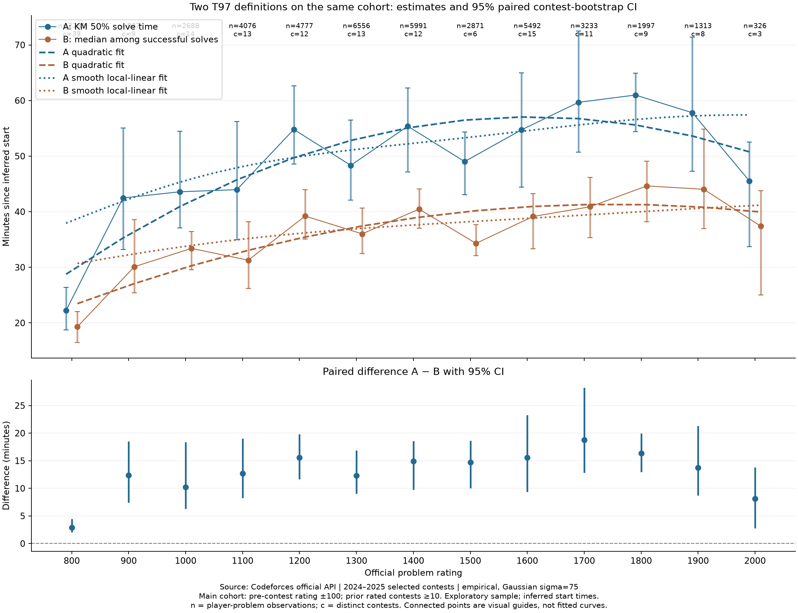

# 扩大样本后的两种 T97 比较

实测数据：41 场 2024–2025 比赛，97 场官方 Rating 变更记录用于核验参赛历史。主口径为赛前 Rating ±100、已证实的赛前 rated 场次 ≥10、高斯 σ=75。800–2000 合计 **42438 条**，其中成功 29723、右删失 12715；各档 326–6556 条。样本单位是选手×题目，同一选手可贡献多条。

每档至少 100 条的目标：**已达到**。各档独立比赛数 3–39，因此大量同场样本不等于同样多的独立信息。

算法 A：加权 Kaplan–Meier 的总体 50% solve time，纳入未解出者的右删失。算法 B：比赛内成功者的加权耗时中位数，作为补充方案的 97% 锚点。两者使用完全相同的候选集合、Rating 窗口与权重；B 在其中条件于成功。单位均为分钟。

13/13 个档位两者都可识别。A−B 点估计范围 2.92–18.78 分钟，差距最大的是 1700 档。 这是本轮经验结果，不外推到所有题目。

- **800**：n=2281，910 位选手，39 场/47 题，成功=2035；A=22.23，95% CI [18.72, 26.38]；B=19.32，95% CI [16.48, 22.05]；A−B=2.92，配对 95% CI [2.02, 4.45]。
- **900**：n=837，686 位选手，9 场/9 题，成功=634；A=42.47，95% CI [33.18, 55.08]；B=30.10，95% CI [25.40, 38.60]；A−B=12.37，配对 95% CI [7.40, 18.48]。
- **1000**：n=2688，1820 位选手，14 场/14 题，成功=2001；A=43.58，95% CI [37.07, 54.47]；B=33.40，95% CI [29.53, 36.47]；A−B=10.18，配对 95% CI [6.27, 18.38]。
- **1100**：n=4076，2489 位选手，13 场/14 题，成功=2982；A=43.97，95% CI [34.93, 56.22]；B=31.28，95% CI [26.17, 38.18]；A−B=12.68，配对 95% CI [8.23, 19.05]。
- **1200**：n=4777，3073 位选手，12 场/13 题，成功=3293；A=54.80，95% CI [48.55, 62.67]；B=39.22，95% CI [35.05, 43.97]；A−B=15.58，配对 95% CI [11.65, 19.80]。
- **1300**：n=6556，4347 位选手，13 场/13 题，成功=4706；A=48.33，95% CI [42.07, 56.48]；B=36.02，95% CI [32.50, 40.67]；A−B=12.32，配对 95% CI [9.03, 16.88]。
- **1400**：n=5991，3904 位选手，12 场/14 题，成功=4071；A=55.38，95% CI [47.12, 62.27]；B=40.47，95% CI [37.00, 44.07]；A−B=14.92，配对 95% CI [9.75, 18.58]。
- **1500**：n=2871，2164 位选手，6 场/6 题，成功=1946；A=49.02，95% CI [43.07, 54.37]；B=34.30，95% CI [32.07, 37.68]；A−B=14.72，配对 95% CI [10.03, 18.63]。
- **1600**：n=5492，3494 位选手，15 场/15 题，成功=3641；A=54.73，95% CI [44.40, 64.97]；B=39.13，95% CI [33.35, 43.22]；A−B=15.60，配对 95% CI [9.35, 23.25]。
- **1700**：n=3233，2145 位选手，11 场/11 题，成功=2043；A=59.67，95% CI [50.70, 72.50]；B=40.88，95% CI [35.33, 46.18]；A−B=18.78，配对 95% CI [12.85, 28.22]。
- **1800**：n=1997，1457 位选手，9 场/9 题，成功=1266；A=60.98，95% CI [54.40, 64.90]；B=44.63，95% CI [38.22, 49.12]；A−B=16.35，配对 95% CI [12.93, 19.93]。
- **1900**：n=1313，954 位选手，8 场/9 题，成功=883；A=57.80，95% CI [47.25, 71.42]；B=44.03，95% CI [36.95, 54.85]；A−B=13.77，配对 95% CI [8.72, 21.30]。
- **2000**：n=326，300 位选手，3 场/3 题，成功=222；A=45.55，95% CI [33.72, 52.53]；B=37.40，95% CI [25.00, 43.75]；A−B=8.15，配对 95% CI [2.73, 13.82]。

## 如何理解差异

A 回答“把未切掉的人也算上，何时累计约一半解出”；B 回答“本次比赛已经切掉的人，典型耗时是多少”。B 适合“成功者中位完成度约 97%”的最新目标；A 保留为总体解出难度诊断。不能把 B 对应的时间宣称为总体 50% 解出时刻，也不能通过计分公式强制实际解出率恰好 50%。

B 条件于比赛截止前成功，后序题剩余时间较短会截掉较慢成功者，不能将曲线变平或局部下降直接解读为高 Rating 选手做题更快。A 的删失校正也依赖假设，不能消除读题起点误差或严格顺序筛选造成的偏差。

两种估计的区间以及 A−B 的区间均由 500 次**配对比赛聚类 bootstrap**产生。保留 KM 不可识别的重复样本，不强填有限上界；同一选手跨比赛的依赖仍未完全处理。差值区间不覆盖 0 也只针对本次选择的参赛群体，不是跨所有题目的因果结论。

## 数据拟合

对 13 个 Rating 档的经验点估计分别拟合加权多项式，权重为每档有效样本量；模型阶数用留一 Rating 档交叉验证选择。KM 曲线选择二次式，LOOCV RMSE=7.07 分钟；成功者中位曲线也选择二次式，RMSE=4.42 分钟。一次式/三次式指标保存在 [fit_metrics.csv](fit_metrics.csv)。这只是描述性平滑，不改变经验 T97，也没有强制单调。完整拟合表见 [t97_fitted.csv](t97_fitted.csv)，参数和残差见 [fit.json](fit.json)。

为了得到更平滑、低预测误差的曲线，另使用加权局部线性 Gaussian smoother，在固定带宽候选中按留一 Rating 档加权 MSE 选带宽。KM 选带宽 200，LOOCV RMSE 5.92 分钟；成功者选带宽 250，RMSE 3.81 分钟。输出 [t97_smooth.csv](t97_smooth.csv) 和 [smooth_fit_metrics.csv](smooth_fit_metrics.csv)。这条曲线追求平滑与预测误差平衡，不会把 1900→2000 的下降人为抹掉。

在 800–2000 范围内，二次拟合的经验预测可用于连续查表，但边界外不应外推；投入产品前仍需按比赛留出验证，并处理题目间相关性。

## 采样方式与前一轮的区别

前一轮为了节约接口调用，只查询 120 位选手的完整历史。本轮对所选比赛的所有合格正式参赛者构建候选记录，并用多场官方 ratingChanges 确认证据：某人在目标题比赛前已出现至少 10 次，就能证明其符合稳定性门槛。记录里的 priorRatedKind=certified_lower_bound 明确表示“已证实的场次下界”，不是精确的全部历史次数。原有完整历史仍用于那 120 位选手。

本轮仍可能排除在所选历史比赛里出现较少、实际却很资深的选手。因此这是一组“可验证稳定参赛者”的样本，不是全体同 Rating 用户的无偏随机样本。前后结果变化不能全部归因于样本量增加；本报告只在本轮同一组数据内公平对比 A/B。

## 筛选敏感性

- 800：九种口径 n=131–18091；A 可识别 9/9，范围 19.58–24.47；B 范围 17.43–21.13。
- 900：九种口径 n=71–5269；A 可识别 9/9，范围 37.43–49.10；B 范围 28.07–32.80。
- 1000：九种口径 n=230–14055；A 可识别 9/9，范围 41.12–45.25；B 范围 30.38–34.18。
- 1100：九种口径 n=351–19280；A 可识别 9/9，范围 41.97–52.18；B 范围 28.95–32.05。
- 1200：九种口径 n=490–19380；A 可识别 9/9，范围 52.98–56.27；B 范围 38.28–39.72。
- 1300：九种口径 n=808–20994；A 可识别 9/9，范围 47.95–51.17；B 范围 35.75–37.00。
- 1400：九种口径 n=803–16806；A 可识别 9/9，范围 54.72–57.22；B 范围 39.95–41.22。
- 1500：九种口径 n=431–7343；A 可识别 9/9，范围 44.98–50.05；B 范围 33.47–34.83。
- 1600：九种口径 n=898–13183；A 可识别 9/9，范围 53.68–55.42；B 范围 37.50–39.48。
- 1700：九种口径 n=487–7508；A 可识别 9/9，范围 57.10–59.73；B 范围 40.07–42.13。
- 1800：九种口径 n=375–4674；A 可识别 9/9，范围 56.90–64.82；B 范围 43.10–45.47。
- 1900：九种口径 n=262–2872；A 可识别 9/9，范围 55.85–58.65；B 范围 43.20–44.10。
- 2000：九种口径 n=46–776；A 可识别 9/9，范围 42.50–52.53；B 范围 35.78–37.60。

九种口径是 Rating ±50/±100/±150 × 赛前参赛 ≥5/≥10/≥20。这里的范围是筛选敏感性，不是 95% CI。阶段门槛中的场次数有下界证据；证据不足不等于实际参赛少于门槛。

计时起点仍是前一道正常 AC 的代理值，不能观察真正开始读题；严格顺序筛选及比赛结束删失仍可能产生选择偏差。所有曲线均为 empirical，不平滑、不强制单调，不根据这一轮数据立即固定 98%–100.5% 的时间分位点。

[分钟单位对比 CSV](comparison.csv) · [完整秒单位统计](t97_raw.csv) · [九组敏感性](sensitivity.csv) · [数据来源与配置](summary.json) · [首批结果](../cf-study-first-batch/REPORT.md)

[800–2000 平滑 T97 表](T97_TABLE.md) · [机器可读表](t97_table.csv)

生成时间：2026-09-16T08:12:57.244Z；抓取失败数：0。原始响应带来源 URL、抓取时间，离线缓存可重建。
