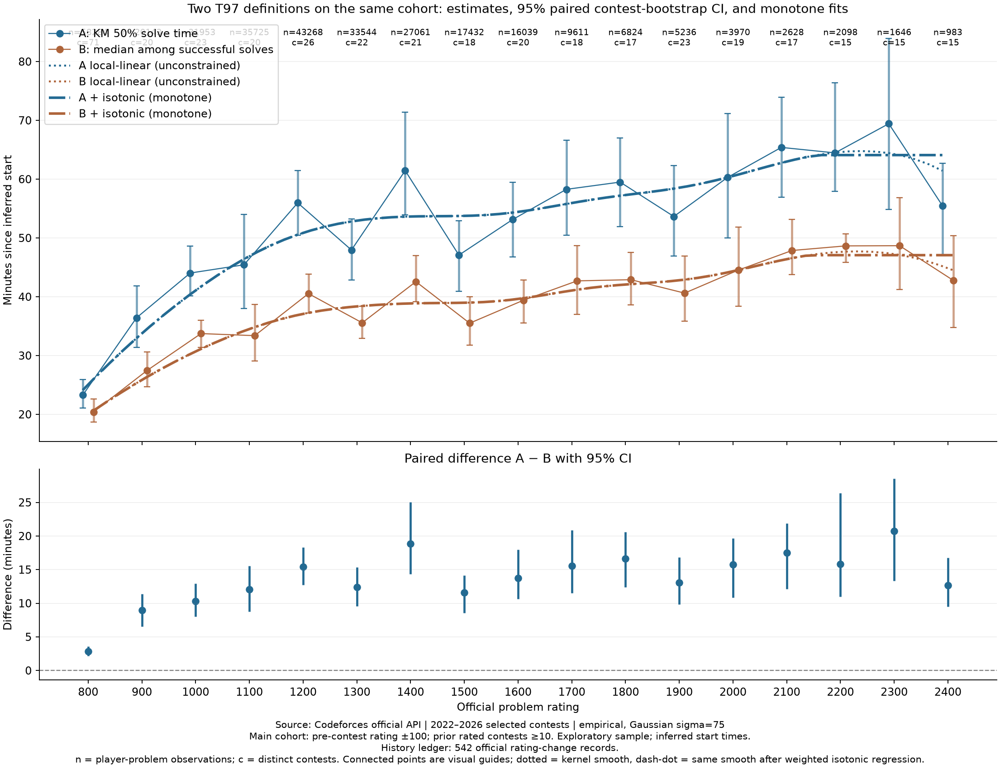

# 扩大样本后的两种 T97 比较

实测数据：92 场 2022–2026 比赛，账本用 542 场官方 Rating 变更记录核验赛前参赛历史。主口径为赛前 Rating ±100、已证实的赛前 rated 场次 ≥10、高斯 σ=75。800–2400 合计 **316445 条**，其中成功 234594、右删失 81851；各档 983–58284 条。样本单位是选手×题目，同一选手可贡献多条。

每档至少 100 条的目标：**已达到**。各档独立比赛数 15–71，因此大量同场样本不等于同样多的独立信息。

算法 A：加权 Kaplan–Meier 的总体 50% solve time，纳入未解出者的右删失。算法 B：比赛内成功者的加权耗时中位数，作为补充方案的 97% 锚点。两者使用完全相同的候选集合、Rating 窗口与权重；B 在其中条件于成功。单位均为分钟。

17/17 个档位两者都可识别。A−B 点估计范围 2.87–20.75 分钟，差距最大的是 2300 档。 这是本轮经验结果，不外推到所有题目。

- **800**：n=58284，24430 位选手，71 场/86 题，成功=52339；A=23.27，95% CI [21.05, 25.93]；B=20.40，95% CI [18.65, 22.58]；A−B=2.87，配对 95% CI [2.20, 3.60]。
- **900**：n=20143，15667 位选手，20 场/20 题，成功=15472；A=36.42，95% CI [31.42, 41.83]；B=27.48，95% CI [24.67, 30.62]；A−B=8.93，配对 95% CI [6.55, 11.38]。
- **1000**：n=31953，22414 位选手，23 场/23 题，成功=23895；A=44.03，95% CI [40.12, 48.65]；B=33.73，95% CI [31.35, 36.03]；A−B=10.30，配对 95% CI [8.05, 12.93]。
- **1100**：n=35725，22915 位选手，20 场/21 题，成功=26325；A=45.43，95% CI [38.02, 54.03]；B=33.38，95% CI [29.05, 38.72]；A−B=12.05，配对 95% CI [8.78, 15.57]。
- **1200**：n=43268，27948 位选手，26 场/27 题，成功=30100；A=55.97，95% CI [50.50, 61.48]；B=40.53，95% CI [37.25, 43.85]；A−B=15.43，配对 95% CI [12.70, 18.28]。
- **1300**：n=33544，22601 位选手，22 场/22 题，成功=23496；A=47.95，95% CI [42.85, 53.27]；B=35.57，95% CI [32.92, 38.42]；A−B=12.38，配对 95% CI [9.58, 15.35]。
- **1400**：n=27061，17342 位选手，21 场/23 题，成功=17730；A=61.45，95% CI [53.95, 71.38]；B=42.57，95% CI [39.13, 47.02]；A−B=18.88，配对 95% CI [14.33, 25.07]。
- **1500**：n=17432，11869 位选手，18 场/18 题，成功=12322；A=47.08，95% CI [40.92, 52.95]；B=35.50，95% CI [31.75, 40.00]；A−B=11.58，配对 95% CI [8.58, 14.15]。
- **1600**：n=16039，10781 位选手，20 场/21 题，成功=10996；A=53.13，95% CI [46.80, 59.48]；B=39.40，95% CI [35.50, 42.82]；A−B=13.73，配对 95% CI [10.62, 17.95]。
- **1700**：n=9611，6405 位选手，18 场/18 题，成功=6449；A=58.27，95% CI [50.50, 66.60]；B=42.70，95% CI [36.98, 48.68]；A−B=15.57，配对 95% CI [11.53, 20.85]。
- **1800**：n=6824，4696 位选手，17 场/17 题，成功=4442；A=59.50，95% CI [51.93, 66.98]；B=42.90，95% CI [38.58, 47.57]；A−B=16.60，配对 95% CI [12.42, 20.58]。
- **1900**：n=5236，3300 位选手，23 场/25 题，成功=3615；A=53.65，95% CI [46.92, 62.30]；B=40.62，95% CI [35.87, 46.93]；A−B=13.03，配对 95% CI [9.82, 16.82]。
- **2000**：n=3970，2440 位选手，19 场/20 题，成功=2651；A=60.30，95% CI [49.97, 71.15]；B=44.53，95% CI [38.38, 51.83]；A−B=15.77，配对 95% CI [10.82, 19.63]。
- **2100**：n=2628，1742 位选手，17 场/17 题，成功=1723；A=65.40，95% CI [56.93, 73.92]；B=47.87，95% CI [43.80, 53.15]；A−B=17.53，配对 95% CI [12.15, 21.87]。
- **2200**：n=2098，1387 位选手，15 场/15 题，成功=1338；A=64.47，95% CI [57.92, 76.38]；B=48.65，95% CI [45.88, 50.68]；A−B=15.82，配对 95% CI [10.97, 26.38]。
- **2300**：n=1646，984 位选手，15 场/16 题，成功=1035；A=69.43，95% CI [54.87, 83.92]；B=48.68，95% CI [41.20, 56.87]；A−B=20.75，配对 95% CI [13.32, 28.53]。
- **2400**：n=983，630 位选手，15 场/15 题，成功=666；A=55.47，95% CI [47.02, 62.68]；B=42.78，95% CI [34.80, 50.37]；A−B=12.68，配对 95% CI [9.52, 16.73]。

## 如何理解差异

A 回答“把未切掉的人也算上，何时累计约一半解出”；B 回答“本次比赛已经切掉的人，典型耗时是多少”。B 适合“成功者中位完成度约 97%”的最新目标；A 保留为总体解出难度诊断。不能把 B 对应的时间宣称为总体 50% 解出时刻，也不能通过计分公式强制实际解出率恰好 50%。

B 条件于比赛截止前成功，后序题剩余时间较短会截掉较慢成功者，不能将曲线变平或局部下降直接解读为高 Rating 选手做题更快。A 的删失校正也依赖假设，不能消除读题起点误差或严格顺序筛选造成的偏差。

两种估计的区间以及 A−B 的区间均由 1000 次**配对比赛聚类 bootstrap**产生。保留 KM 不可识别的重复样本，不强填有限上界；同一选手跨比赛的依赖仍未完全处理。差值区间不覆盖 0 也只针对本次选择的参赛群体，不是跨所有题目的因果结论。

## 数据拟合

对 17 个 Rating 档的经验点估计分别拟合加权多项式，权重为每档有效样本量；模型阶数用留一 Rating 档交叉验证选择。KM 曲线选择 2 次式，LOOCV RMSE=6.98 分钟；成功者中位曲线选择 2 次式，RMSE=3.88 分钟。一次式/二次式/三次式指标保存在 [fit_metrics.csv](fit_metrics.csv)。这只是描述性平滑，不改变经验 T97。完整拟合表见 [t97_fitted.csv](t97_fitted.csv)，参数和残差见 [fit.json](fit.json)。

为了得到更平滑、低预测误差的曲线，另使用加权局部线性 Gaussian smoother，在固定带宽候选中按留一 Rating 档加权 MSE 选带宽。KM 选带宽 150，LOOCV RMSE 6.99 分钟；成功者选带宽 125，RMSE 3.85 分钟。未约束结果输出在 [t97_smooth.csv](t97_smooth.csv)：它不做形状约束，但**带宽本身仍会抹掉窄幅交替**，这部分不是「保留」而是「看不出」，见下面「口径稳健的局部反转」。

在此之上再做一层**加权保序回归**（PAVA），把「同 Rating 下 T97 不应随题目 Rating 下降」这个形状先验显式写进估计，输出 [t97_monotone.csv](t97_monotone.csv)。权重取每处核函数权重之和，因此样本稀少的档位权重低、会被邻近档位拉动 —— 这正是用来压住右端反转的机制。代价是它可能掩盖真实反转，所以未约束版本同时保留，逐档调整量与是否落在该档 95% 区间内见 [MONOTONE.md](MONOTONE.md)，主表 [T97_TABLE.md](T97_TABLE.md) 把两列并排列出。

在 800–2400 范围内，平滑后的经验预测可用于连续查表，但边界外不应外推；投入产品前仍需按比赛留出验证，并处理题目间相关性。

### 口径稳健的局部反转（读表前必读）

- 成功者中位（推荐 T97 锚点）：**1200 档反而高于 1300 档**。九种筛选口径下 1200 档为 39.92–41.80 分钟，1300 档为 35.10–36.15 分钟，两个区间**不重叠**（换任何一种 Rating 窗口或稳定性门槛都翻不回来）。主推曲线里这一处已经消失，抹掉它的是**核平滑**。
- KM 50% solve time：**1200 档反而高于 1300 档**。九种筛选口径下 1200 档为 55.77–56.52 分钟，1300 档为 47.45–48.92 分钟，两个区间**不重叠**（换任何一种 Rating 窗口或稳定性门槛都翻不回来）。主推曲线里这一处已经消失，抹掉它的是**核平滑**。
- 成功者中位（推荐 T97 锚点）：**1400 档反而高于 1500 档**。九种筛选口径下 1400 档为 42.03–43.25 分钟，1500 档为 35.12–36.25 分钟，两个区间**不重叠**（换任何一种 Rating 窗口或稳定性门槛都翻不回来）。主推曲线里这一处已经消失，抹掉它的是**核平滑**。
- KM 50% solve time：**1400 档反而高于 1500 档**。九种筛选口径下 1400 档为 60.05–62.80 分钟，1500 档为 46.47–48.30 分钟，两个区间**不重叠**（换任何一种 Rating 窗口或稳定性门槛都翻不回来）。主推曲线里这一处已经消失，抹掉它的是**核平滑**。
- 成功者中位（推荐 T97 锚点）：**1800 档反而高于 1900 档**。九种筛选口径下 1800 档为 42.18–43.42 分钟，1900 档为 40.42–40.90 分钟，两个区间**不重叠**（换任何一种 Rating 窗口或稳定性门槛都翻不回来）。主推曲线里这一处已经消失，抹掉它的是**核平滑**。
- KM 50% solve time：**1800 档反而高于 1900 档**。九种筛选口径下 1800 档为 57.45–60.93 分钟，1900 档为 52.75–54.68 分钟，两个区间**不重叠**（换任何一种 Rating 窗口或稳定性门槛都翻不回来）。主推曲线里这一处已经消失，抹掉它的是**核平滑**。
- 成功者中位（推荐 T97 锚点）：**2300 档反而高于 2400 档**。九种筛选口径下 2300 档为 47.15–49.98 分钟，2400 档为 42.10–43.65 分钟，两个区间**不重叠**（换任何一种 Rating 窗口或稳定性门槛都翻不回来）。主推曲线里这一处已经消失，抹掉它的是**保序回归**。
- KM 50% solve time：**2300 档反而高于 2400 档**。九种筛选口径下 2300 档为 66.10–75.32 分钟，2400 档为 53.42–57.72 分钟，两个区间**不重叠**（换任何一种 Rating 窗口或稳定性门槛都翻不回来）。主推曲线里这一处已经消失，抹掉它的是**保序回归**。

区间不重叠说明这不是样本量不足造成的噪声，而是数据里的形状。主推曲线把这些反转全部消掉了，但用的是两种**代价不同**的机制：

- **核平滑抹掉的**：带宽 125 的局部线性平滑对 ±125 范围内的档位做加权平均，相邻档相差几分钟的交替在平均里就抵消了。代价是那里若真有信号，也一并被吃掉 —— 所以下面的「未约束对照」**不能**证明核平滑没吃信号，它只跳过了保序回归那一步。
- **保序回归压平的**：这些反转在未约束平滑里依然存在，只能靠形状约束合并成平线（本次是 2300→2400）。只有这些位置的平滑值可能落到自身经验点 95% 区间之外，[MONOTONE.md](MONOTONE.md) 里标为「否」—— 那是「不许下降」这条先验与数据正面冲突时的必然结果。

因此主推曲线应当读成「**在『T97 不随难度下降』这一先验下最保守的估计**」，而不是实测点。要做产品决策时以本节列出的实测区间为准。

一个候选机制是成功者条件化偏差：题目越难，在题序里越靠后，剩余比赛时间越短，慢速成功者越早被删失，于是「成功者中位」被系统性压低。现有数据无法排除该机制，因此**不能**把高档位的低读数解读成「高 Rating 题目对匹配选手反而更容易」。

## 采样方式与前一轮的区别

前一轮为了节约接口调用，只查询 120 位选手的完整历史。本轮对所选比赛的所有合格正式参赛者构建候选记录，并用多场官方 ratingChanges 确认证据：某人在目标题比赛前已出现至少 10 次，就能证明其符合稳定性门槛。记录里的 priorRatedKind=certified_lower_bound 明确表示“已证实的场次下界”，不是精确的全部历史次数。原有完整历史仍用于那 120 位选手。
本轮先把 2022–2026 全部正式比赛的 Rating 变更并进账本（共 542 场），再挑比赛补档位。这一步是必要的：账本原先只覆盖 97 场、平均每月 1–4 场，而「赛前已参赛 ≥10 场」完全依赖它证明，结果是低档位只有极活跃的老手能过关 —— 800 档窗口内有 68025 条记录、只有 2281 条通过，通过率 3.4%，其中 65% 卡在 1–4 场。账本铺满后，同一批比赛的合格记录大幅增加，纳入的人也更接近「稳定参赛」而不是「异常活跃」。

本轮仍可能排除在所选历史比赛里出现较少、实际却很资深的选手。因此这是一组“可验证稳定参赛者”的样本，不是全体同 Rating 用户的无偏随机样本。前后结果变化不能全部归因于样本量增加；本报告只在本轮同一组数据内公平对比 A/B。

## 筛选敏感性

- 800：九种口径 n=9329–145047；A 可识别 9/9，范围 21.00–28.13；B 范围 18.52–23.50。
- 900：九种口径 n=4081–47707；A 可识别 9/9，范围 35.23–43.72；B 范围 27.07–29.65。
- 1000：九种口径 n=7790–68425；A 可识别 9/9，范围 43.13–47.83；B 范围 33.18–35.03。
- 1100：九种口径 n=10088–70457；A 可识别 9/9，范围 45.02–47.35；B 范围 33.05–34.15。
- 1200：九种口径 n=14246–78609；A 可识别 9/9，范围 55.77–56.52；B 范围 39.92–41.80。
- 1300：九种口径 n=12238–57724；A 可识别 9/9，范围 47.45–48.92；B 范围 35.10–36.15。
- 1400：九种口径 n=10613–45127；A 可识别 9/9，范围 60.05–62.80；B 范围 42.03–43.25。
- 1500：九种口径 n=7129–27477；A 可识别 9/9，范围 46.47–48.30；B 范围 35.12–36.25。
- 1600：九种口径 n=6645–25982；A 可识别 9/9，范围 51.93–54.85；B 范围 38.87–40.15。
- 1700：九种口径 n=3987–15745；A 可识别 9/9，范围 56.93–59.15；B 范围 42.23–43.07。
- 1800：九种口径 n=2786–11542；A 可识别 9/9，范围 57.45–60.93；B 范围 42.18–43.42。
- 1900：九种口径 n=2145–8701；A 可识别 9/9，范围 52.75–54.68；B 范围 40.42–40.90。
- 2000：九种口径 n=1596–6366；A 可识别 9/9，范围 58.38–60.90；B 范围 43.88–45.33。
- 2100：九种口径 n=1062–4339；A 可识别 9/9，范围 63.77–67.28；B 范围 47.85–50.05。
- 2200：九种口径 n=836–3407；A 可识别 9/9，范围 62.22–65.17；B 范围 48.42–49.57。
- 2300：九种口径 n=643–2863；A 可识别 9/9，范围 66.10–75.32；B 范围 47.15–49.98。
- 2400：九种口径 n=354–1783；A 可识别 9/9，范围 53.42–57.72；B 范围 42.10–43.65。

九种口径是 Rating ±50/±100/±150 × 赛前参赛 ≥5/≥10/≥20。这里的范围是筛选敏感性，不是 95% CI。阶段门槛中的场次数有下界证据；证据不足不等于实际参赛少于门槛。

计时起点仍是前一道正常 AC 的代理值，不能观察真正开始读题；严格顺序筛选及比赛结束删失仍可能产生选择偏差。各档经验点估计均为 empirical、不平滑；主推曲线只在核平滑之上加了单调约束，且与未约束版本并排给出，不据此固定 98%–100.5% 的时间分位点。

[分钟单位对比 CSV](comparison.csv) · [完整秒单位统计](t97_raw.csv) · [九组敏感性](sensitivity.csv) · [数据来源与配置](summary.json) · [首批结果](../cf-study-first-batch/REPORT.md)

[800–2400 平滑 T97 表](T97_TABLE.md) · [机器可读表](t97_table.csv)

生成时间：2026-09-21T06:17:01.220Z；抓取失败数：1。原始响应带来源 URL、抓取时间，离线缓存可重建。
